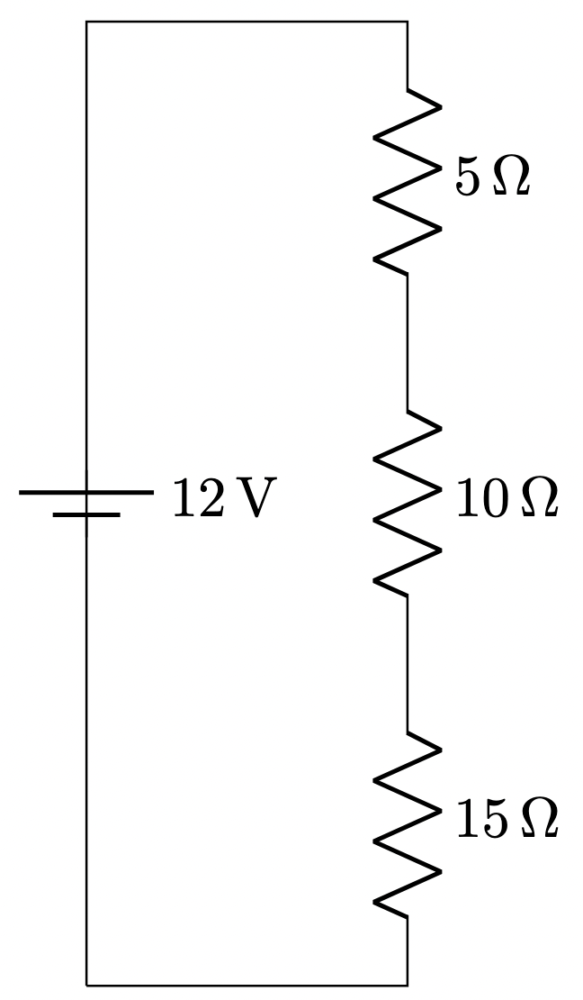

# Series vs Parallel Circuits

In electrical circuits, **series** and **parallel** refer to two fundamental ways of connecting components, each with distinct characteristics affecting current, voltage, and resistance.

## Series Circuits

{ width="200" }

-   **Connection:** Components are connected end-to-end in a single path for the current to flow.
-   **Current:** The same current flows through all components.
-   **Voltage:** The total voltage is divided among the components.
-   **Resistance:** Total resistance is the sum of individual resistances:
$$
R\_{\\text{total}} = R\_1 + R\_2 + \\dots + R\_n
$$

<!--
\documentclass[border=10pt]{standalone}
\usepackage{circuitikz}

\begin{document}
\begin{circuitikz}[american]
    \draw
    (0,0) to[battery1,l=$12\,\mathrm{V}$] (0,6)
    -- (0,6) -- (2,6)
    to[R,l=$5\,\Omega$] (2,4)
    to[R,l=$10\,\Omega$] (2,2)
    to[R,l=$15\,\Omega$] (2,0)
    -- (2,0) -- (0,0);
\end{circuitikz}
-->

## Parallel Circuits

- **Connection:** Components are connected across the same two points, creating multiple paths for the current.
- **Voltage:** The same voltage is applied across each component.
- **Current:** The total current is the sum of the currents through each parallel branch.
- **Resistance:** Total resistance is less than any individual resistance and is calculated using the reciprocal formula:

$$
R_{\text{total}} = \frac{1}{R_1} + \frac{1}{R_2} + \dots + \frac{1}{R_n}
$$

## Example 1: Series Circuit

Imagine three resistors with resistances of 5 Ω, 10 Ω, and 15 Ω connected in series to a 12 V battery.

### Total Resistance

$$
R_{\text{total}}=5 Ω+10 Ω+15 Ω=30 Ω
$$

### Current Through Circuit

$$
I = \frac{V}{R_{\text{total}}} = \frac{12\,V}{30\,\Omega} = 0.4\,A
$$

### Voltage Across Each Resistor

$$
V_1=I×R_1=0.4 A×5Ω = 2V
$$

$$
V_2=I×R_2=0.4 A×10Ω = 4V
$$

$$
V_3=I×R_3=0.4 A×15Ω = 6V
$$

### Example 2: Parallel Circuit Example

Now, connect the same resistors (5 Ω, 10 Ω, and 15 Ω) in parallel to a 12 V battery.

<!--
\documentclass[border=10pt]{standalone}
\usepackage{circuitikz}

\begin{document}
\begin{circuitikz}[american]

    % Draw the battery from (0,0) to (0,4)
    \draw
    (0,0) to[battery1,l_=$12\,\mathrm{V}$] (0,4);

    % Draw the positive and negative rails
    \draw
    (0,4) -- (6,4); % Positive rail
    \draw
    (0,0) -- (6,0); % Negative rail

    % Connect the resistors between the rails
    \draw
    (2,4) to[R,l=$5\,\Omega$] (2,0);
    \draw
    (4,4) to[R,l=$10\,\Omega$] (4,0);
    \draw
    (6,4) to[R,l=$15\,\Omega$] (6,0);

\end{circuitikz}
\end{document}

-->

### Total Resistance of Parallel Resistors

$$
\frac{1}{R_{\text{total}}}=\frac{1}{5 Ω} + \frac{1}{10 Ω} +\frac{1}{15 Ω}
= \frac{6 + 3 + 2}{30 Ω} = \frac{11}{30 Ω}
$$

So,
$$
R_{\text{total}} = \frac{30 Ω}{11}≈2.73 Ω
$$

### Total Current

$$
I_{\text{total}}=V \times R_{\text{total}}=12 V \times 2.73 Ω ≈ 4.4 A
$$

### Current Through Each Resistor

$$
I_1 = \frac{V}{R_1} = \frac{12 V}{5Ω} = 2.4A
$$

$$
I_2 = \frac{V}{R_2} = \frac{12 V}{10Ω} = 1.2A
$$

$$
I_3 = \frac{V}{R_3} = \frac{12 V}{15Ω} = 0.8A
$$

The sum of branch currents equals the total current: 

$$
2.4 A + 1.2 A + 0.8 A = 4.4A
$$

These examples illustrate how series circuits have a single path with shared current and divided voltage, while parallel circuits have multiple paths with shared voltage and divided current.