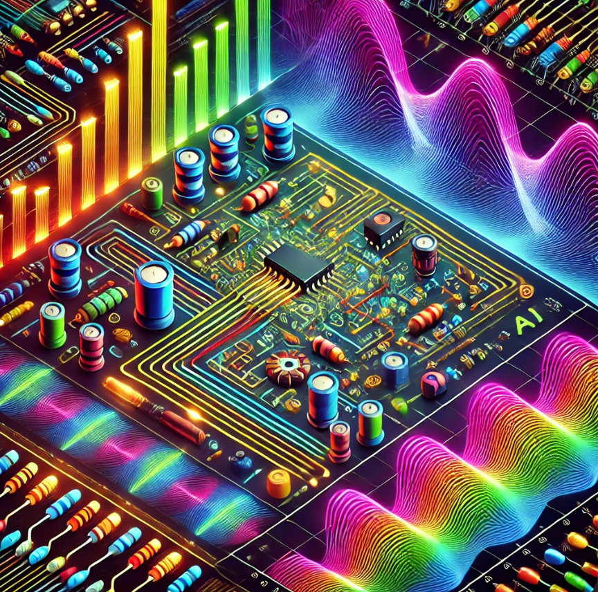

# Circuits

Welcome to the website for an exciting new interactive
undergraduate course for Artificial Intelligence-driven electronic circuits. This course is different from
many traditional circuits courses because it uses generative AI
and interactive simulations to teach the theory and practice
of understanding and designing electronics circuits.

We not only use generative AI to create fun circuit
simulations, we provide you the [prompts](./prompts/index.md) for you
to customize interactive diagrams to your needs.

From our knowledge, this is one of the first circuits
course that assumes that all students have access
to a generative AI program such as ChatGPT.  Because
we make this assumption, we can leverage generative
AI tools to create a fun interactive learning experience
that gives you an intuitive feel for how circuits work.

We also provide an extensive library of both templates
and detailed prompts to allow
students to generate their own experiments with
the help of generative AI tools.

Please contact me on [Dan McCreary LinkedIn](https://www.linkedin.com/in/danmccreary/) if you have questions.

- Dan

