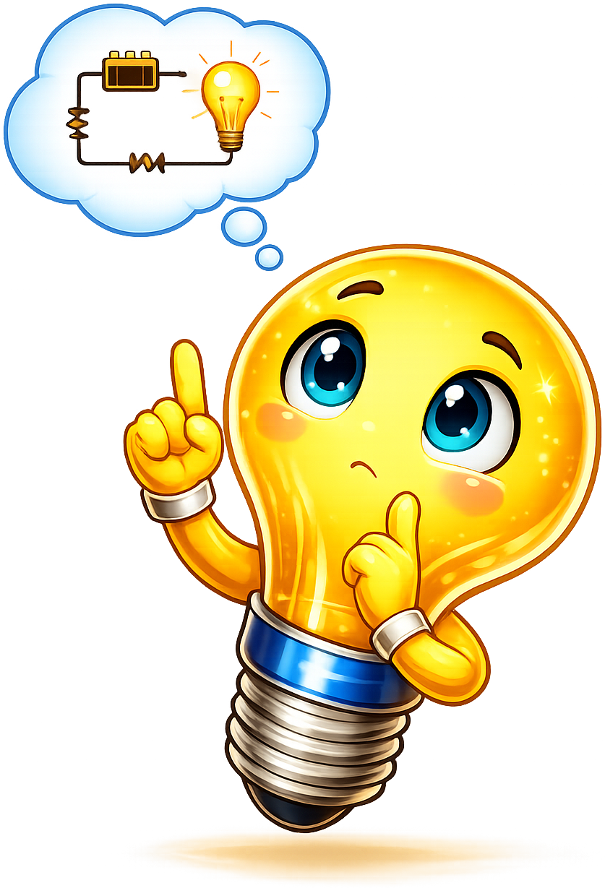
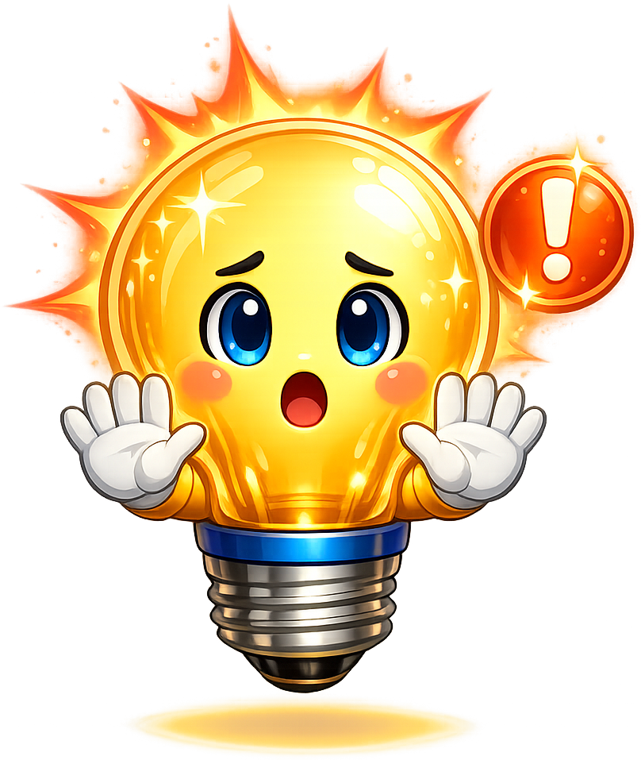
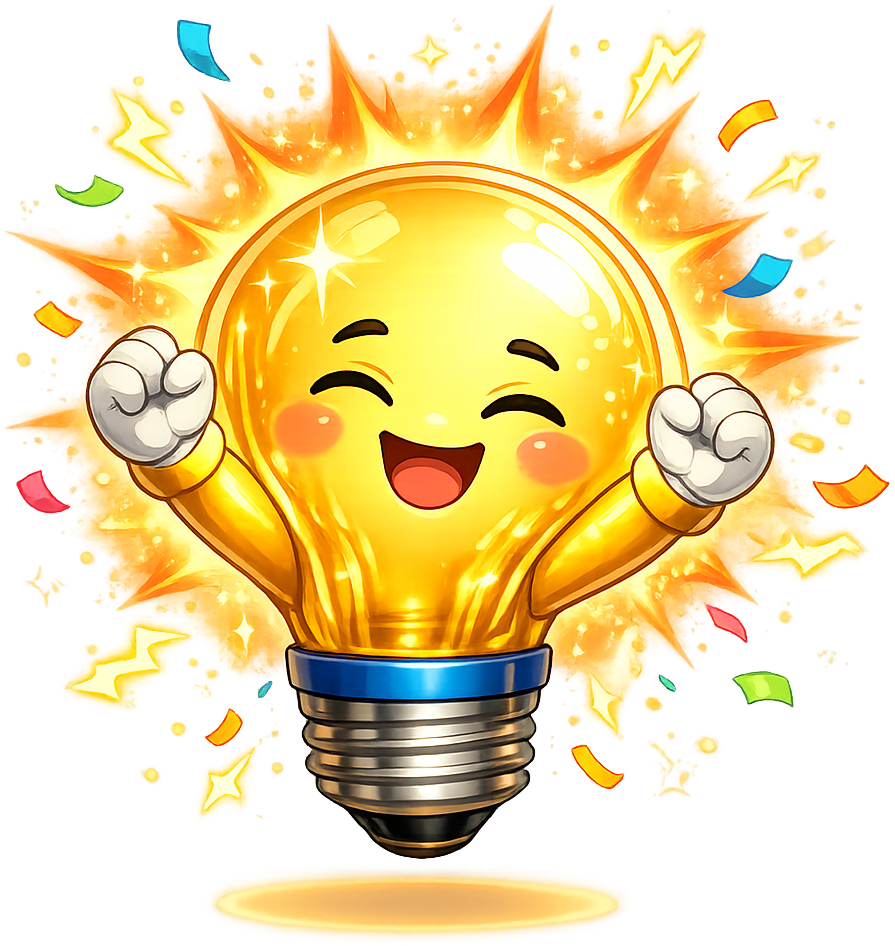

# Sparky the Lightbulb - Mascot Test

This page shows all Sparky mascot images and admonition styles for reference.
Check that all images have a transparent background and do not have excessive
padding around the drawing.

Note that the images below have a dashed blue border so you can clearly see the padding.

## Admonition Tests

!!! mascot-welcome "Sparky's Welcome"
    
    Welcome to the Circuits course! I'm Sparky, your guide through the fascinating
    world of electronic circuits. Buckle up — we're about to discover how electrons
    flow, how components behave, and how to build real-world circuits!

!!! mascot-thinking "Sparky Thinking"
    
    See that voltage drop across the resistor? Ohm's Law isn't just a formula —
    it's describing something *real* happening to those electrons right now.

!!! mascot-tip "Sparky's Tip"
    
    When analyzing a circuit, always start by identifying the ground reference.
    Everything else is measured relative to that point. Pick it wisely and the
    math gets a lot cleaner.

!!! mascot-warning "Sparky's Warning"
    
    Don't confuse voltage and current! Voltage is the *pressure* pushing
    electrons through a wire. Current is the *flow* of those electrons.
    You need both to understand power — and to avoid frying your components!

!!! mascot-encouraging "Sparky's Encouragement"
    
    Circuit analysis can feel overwhelming at first — so many symbols, so many
    equations. Don't worry! Every expert engineer started exactly where you are.
    Keep working through the examples, one node and one loop at a time, and it
    will start to click.

!!! mascot-celebration "Sparky Celebrates"
    
    You did it! You just solved your first circuit using Kirchhoff's Laws.
    That's a huge milestone — the same techniques you used here scale up to
    analyze everything from smartphone chargers to spacecraft power systems.
    Take a moment to appreciate what you just learned!

## Image Boundry Tests

1. Neutral
{ width="150px"}
2. Welcome
{ width="150px"}
3. Thinking
{ width="150px"}
4. Tip
{ width="150px"}
5. Gentle Warning
{ width="150px"}
6. Encouraging
{ width="150px"}
7. Celebration
{ width="150px"}

