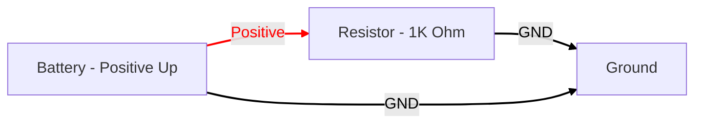
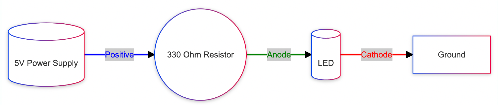
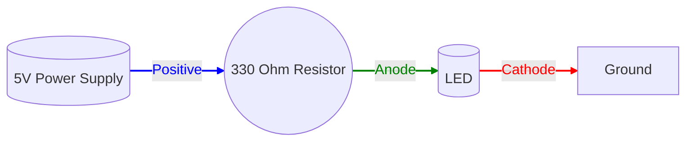

# Circuit Generation with Mermaid

Mermaid diagrams are fine for many workflows diagrams, but they
are not specialized for generating high-quality circuit
diagrams.  We include this only to show how
generative AI can generate diagrams.

## Mermaid Prompt

```linenums="0"
You are an expert at generating Mermaid diagrams
to illustrate circuit topology.  Generate a
circuit diagram that includes the following:

1. A power supply on the left.
2. A red power rail at the top
3. A 1K ohm resistor on the right
4. A ground wire at the bottom
```




## Mermaid AI

The [Mermaid Chart](https://www.mermaidchart.com/) has
a tool that allows you to describe your circuit and
it will use that prompt to generate a Mermaid diagram.


### Prompt

Here is a sample prompt:

```linenums="0"
Create a circuit diagram that has a 5-volt power supply, a 330 ohm resistor and an LED. Use icons for each component.
```

This generated the following diagram:





Note that the AI correctly generated the edge names:

1. Power Supply Positive
2. LED Anode
3. LED Cathode

## Adding Images

Mermaid also allows you to add images to a diagram.

```
n1["This is sample label"]

    n1@{ img: "https://images.pexels.com/photos/2280547/pexels-photo-2280547.jpeg?auto=compress&cs=tinysrgb&w=1260&h=750&dpr=1", h: 300, w: 100, pos: "b"}
```

[Sample](https://www.mermaidchart.com/app/projects/d015ecae-577e-4367-a816-6012421faf7b/diagrams/82ce93f2-5bf1-4727-a943-59d01d5b8476/version/v0.1/edit)