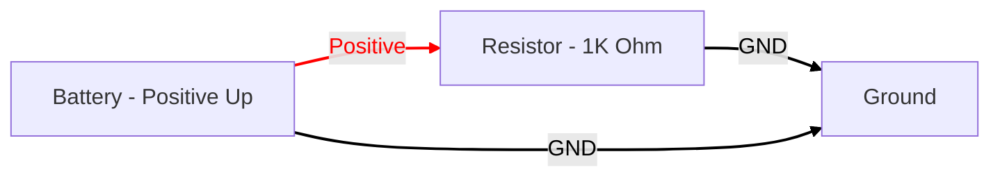

# Circuit Generation with Mermaid

## Mermaid Prompt

[Sample](https://www.mermaidchart.com/app/projects/d015ecae-577e-4367-a816-6012421faf7b/diagrams/82ce93f2-5bf1-4727-a943-59d01d5b8476/version/v0.1/edit)