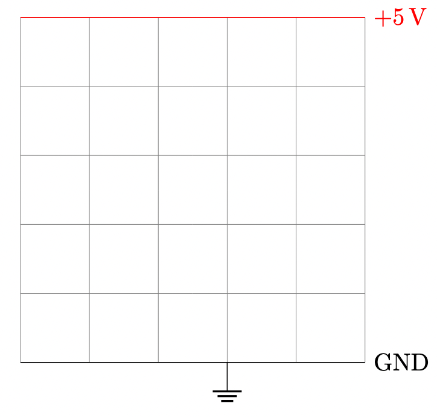
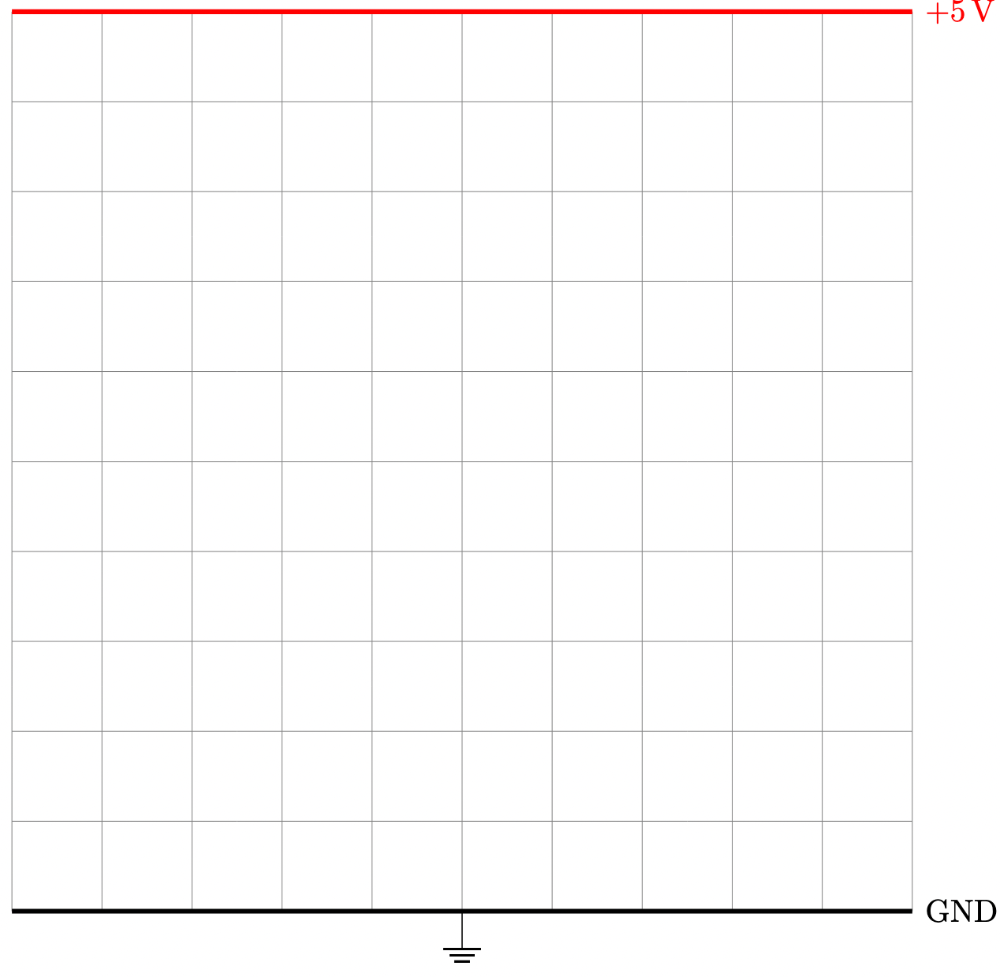

# CircuiTikZ Templates

## Standard 5x5 Template

Use this template for very simple circuits that have
just a few components.  It includes a background
grid that can be removed after component placement.



```
% template for a 5X5 grid layout
\documentclass[border=10pt]{standalone}
\usepackage{circuitikz}

\begin{document}
\begin{circuitikz}[american]

    % Draw the background grid 
    \draw[gray, very thin] (0,0) grid (5,5);
    
    % Draw the positive rail (red) at y=5
    \draw[red] (0,5) -- (5,5) node[right]{$+5\,\mathrm{V}$};

    % Draw the ground rail (black) at y=0
    \draw[black] (0,0) -- (5,0) node[right]{GND}; 
    % Ground rail symbol 1/2 way
   \draw (3,0) node[ground]{};

    % Place your components here
    % ....
\end{circuitikz}
\end{document}
```

## Standard 10x10 Template



```
% template for a 5X5 grid layout
\documentclass[border=10pt]{standalone}
\usepackage{circuitikz}

\begin{document}
\begin{circuitikz}[american]

    % Draw the background grid 
    \draw[gray, very thin] (0,0) grid (10,10);
    
    % Draw the positive rail (red) at y=5
    \draw[red,line width=1.5pt] (0,10) -- (10,10) node[right]{$+5\,\mathrm{V}$};

    % Draw the ground rail (black) at y=0
      % Draw the ground rail (black) at y=0
    \draw[black,line width=1.5pt] (0,0) -- (10,0) node[right]{GND}; 
    % draw the ground symbol 1/2 way
    \draw (5,0) node[ground]{};

\end{circuitikz}
\end{document}
```