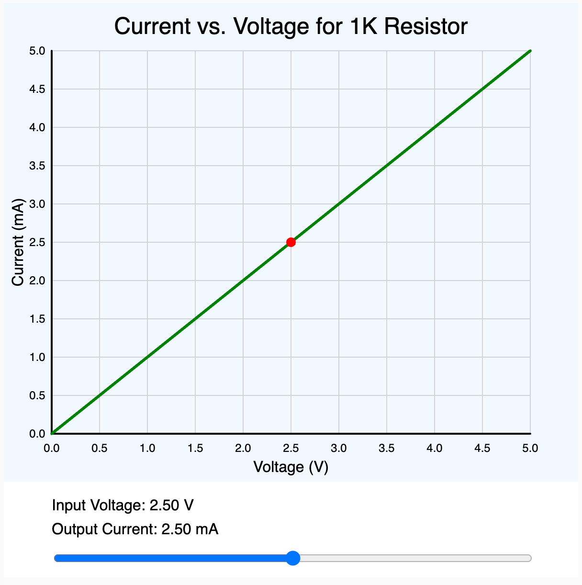

# Basic Current-Voltage Plot Prompt

<center>
<iframe width="600" height="650" style="border:solid 1px black;" src="https://editor.p5js.org/dmccreary/full/fiQeW-8ai"></iframe>
</center>



This prompt is useful when you are plotting the current vs. voltage
of a circuit.  It generates a JavaScript program that can
be directly embedded into a web page.  The default JavaScript
library we use is processing version 5.

## Sample Program

## Sample Prompt

```linenums="0"
You are an expert at creating interactive educational
animations using the p5.js javascript library.

General Task Instructions:
Create an interactive p5.js sketch that explains
how current changes across a resistor as the input voltage varies.
Make the title of the animation be "Current vs. Voltage for a Resistor".
Use realistic values for 0-5 volt voltage source given a 1K ohm resistor.

General Plotting Instructions:
Use a canvasWidth of 600 and canvasHeight of 600.
The canvas has two regions.
The top region is the plot region.
The plot region is 600 wide and 500 high.
The bottom region is the controls region.
The controls region is 600 wide and 100 high.
The plot area has a background color of aliceblue.
The plot margin is 50.
Current is on the vertical axis.
Voltage is on the horizontal axis.
The plot has a vertical grid line of every 0.5 of a volt.
The plot has a horizontal grid at every 0.5 milliamp.
The grid lines have a color of light gray.
The grid lines are thin with a weight of 1.
There are numeric tick marks on both axis.
The title, axis labels and tick numbers are in black.
The control area is size 600x100 and has a white background.

Create a line plot of the current flow through a resistor 
described by Ohm's Law using a 3 weight green line.
Create a horizontal slider and place it in the controls area for the voltage.
Make the slider have a minimum of 0.0 volts and a maximum of 5 volts.
Give the input voltage slider a default value of 1 volts.
Draw a red circle size 10 at the operating point on the line curve.
Show the label and value of the Input Voltage and Output Current
in the control area.
```