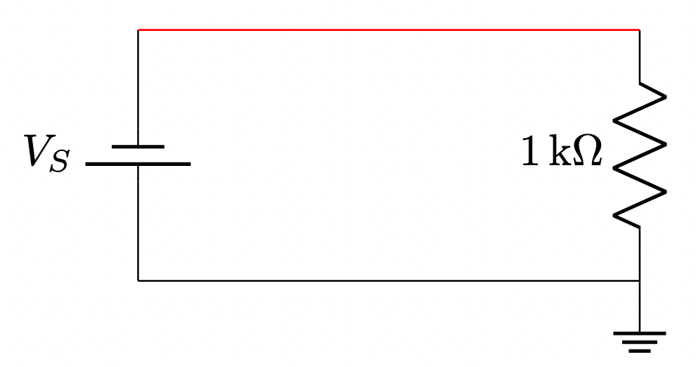
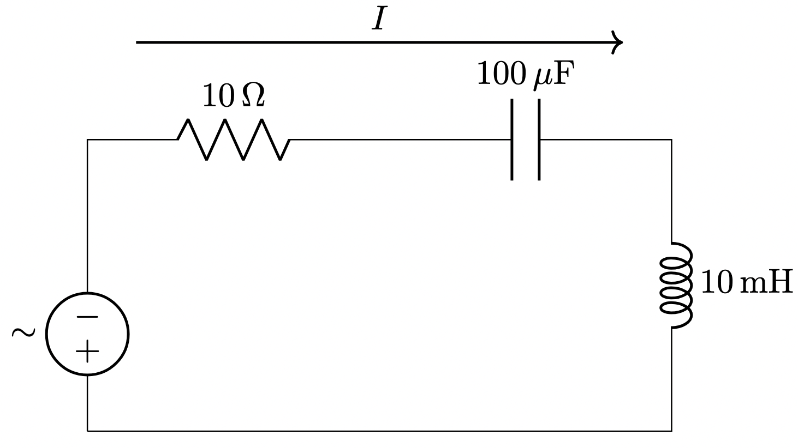

# Generating Circuit Diagrams With LaTeX and CircuiTikZ

CircuiTikZ is a [LaTeX]() extension package which provides a set of 
macros for typesetting electrical and electronic networks.  You simply specify a
component type, a grid placement and some connections and CircuiTikZ
will transform this specification into a high-quality circuit diagram.

CircuiTikZ was originally created by Massimo Redaelli to create and exercise book and exams sheets for his courses at where he was an instructor. He wanted a tool that was easy to use, with a lean syntax, native to LaTeX, and supporting directly PDF output format.  Like LaTeX, CircuiTikZ is a GNU licensed library although
there are also commercial offerings that allow for web based interactive
rendering.  One example is the [Overleaf.com](https://www.overleaf.com/learn/latex/TikZ_package) website.

## TikZ Vector-Based Drawing Within LaTeX

TikZ is a powerful graphics package for creating vector-based illustrations directly within LaTeX documents. The name "TikZ" is a recursive acronym: "TikZ ist kein Zeichenprogramm," which is German for "TikZ is not a drawing program." TikZ provides a syntax for specifying graphics in a programmatic way, allowing for the creation of complex diagrams, plots, and figures that integrate seamlessly with LaTeX's typesetting.

## What is the TikZ Syntax?

The TikZ syntax consists of a set of LaTeX commands and environments that describe how to draw various shapes, lines, and other graphical elements. The basic structure involves the \begin{tikzpicture} and \end{tikzpicture} environment, within which you can place TikZ commands to create graphics.

Here's a simple example:


https://www.overleaf.com/learn/latex/TikZ_package

## Basic Format


```latex
\documentclass{article}
\usepackage{circuitikz}

\begin{document}
\begin{circuitikz}[american]
  \draw (0,0) to[battery1,l=$V$] (0,2)
        to[R=$R$] (2,2)
        to[L=$L$] (2,0)
        -- (0,0);
\end{circuitikz}
```

## Basic Resistor Circuit



```latex
\documentclass{article}
\usepackage{circuitikz}

\begin{document}
\begin{circuitikz}[american]
  % Draw the voltage source on the left
  \draw (0,0) to[battery1,l=$V_S$] (0,2);

  % Draw the horizontal red positive wire across the top
  \draw[red] (0,2) -- (4,2);

  % Place the 1K ohm resistor on the right side
  \draw (4,2) to[R,l_=$1\,\mathrm{k}\Omega$] (4,0);

  % Draw the black horizontal ground wire on the bottom
  \draw (0,0) -- (4,0);
  \draw (4,0) node[ground]{};
\end{circuitikz}
\end{document}
```

## RLC Example

```linenums="0"
You are an expert at generating high-quality circuit diagrams using the LaTeX CircuiTikZ
library.  For the following circuit, generate the corresponding circuit diagram using LaTeX CircuiTikZ format:

Create a diagram of a simple RLC circuit with all components in series.
Place an AC power signal on the left side.
Place the components on the top and right side.
Place a 10 ohm resistor,
a 100 microfarad capacitor,
and a 10 millihenry inductor in series in the circuit.
Label all the components with their values.
Create an arrow that shows the direction of the current.
```



```latex
\begin{circuitikz}[american voltages]
\draw
 %  AC Power Source
  (0,0) to[american voltage source, l=$\sim$] (0,2) -- (0,3)
  % Resistor
  to [R, l=$10\,\Omega$] (3,3)
  % Capacitor
  to [C, l=$100\,\mu\mathrm{F}$] (6,3)
  % Inductor
  to [L, l=$10\,\mathrm{mH}$] (6,0) -- (0,0);
  
% Draw the current arrow
\draw[->, thick] (0.5,4) -- (5.5,4) node[midway, above] {$I$};
\end{circuitikz}
```


## Complex Example

```latex
```
## References

* [circuitikz manual](https://us.mirrors.cicku.me/ctan/graphics/pgf/contrib/circuitikz/doc/circuitikzmanual.pdf)
* [CircuiTikz GitHub Repo](https://github.com/circuitikz/circuitikz)
* [Overleaf LaTex CircuiTikz Tutorial Introduction](https://www.overleaf.com/learn/latex/CircuiTikz_package#Introduction)