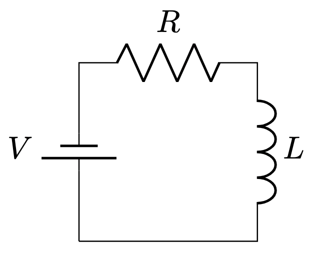

# Generating Circuit Diagrams With LaTeX and Circuitikz

LaTeX with the Circuitikz

## Basic Format



```latex
\documentclass{article}
\usepackage{circuitikz}

\begin{document}
\begin{circuitikz}[american]
  \draw (0,0) to[battery1,l=$V$] (0,2)
        to[R=$R$] (2,2)
        to[L=$L$] (2,0)
        -- (0,0);
\end{circuitikz}
```

## Basic Resistor Circuit


```latex
\documentclass{article}
\usepackage{circuitikz}

\begin{document}
\begin{circuitikz}[american]
  % Draw the voltage source on the left
  \draw (0,0) to[battery1,l=$V_S$] (0,2);

  % Draw the horizontal red positive wire across the top
  \draw[red] (0,2) -- (4,2);

  % Place the 1K ohm resistor on the right side
  \draw (4,2) to[R,l_=$1\,\mathrm{k}\Omega$] (4,0);

  % Draw the black horizontal ground wire on the bottom
  \draw (0,0) -- (4,0);
  \draw (4,0) node[ground]{};
\end{circuitikz}
\end{document}
```
