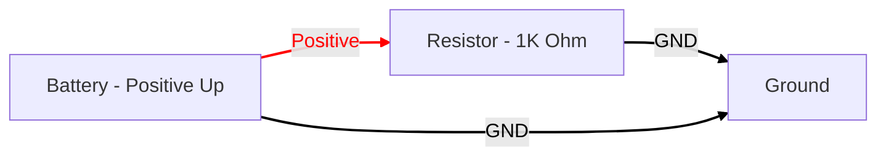

# Circuit Generation with Mermaid

Mermaid diagrams are fine for many workflows diagrams, but they
are not specialized for generating high-quality circuit
diagrams.  We include this only to show how
generative AI can generate diagrams.

## Mermaid Prompt

```linenums="0"
You are an expert at generating Mermaid diagrams
to illustrate circuit topology.  Generate a
circuit diagram that includes the following:

1. A power supply on the left.
2. A red power rail at the top
3. A 1K ohm resistor on the right
4. A ground wire at the bottom
```




[Sample](https://www.mermaidchart.com/app/projects/d015ecae-577e-4367-a816-6012421faf7b/diagrams/82ce93f2-5bf1-4727-a943-59d01d5b8476/version/v0.1/edit)