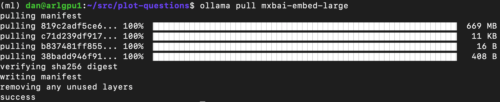

# Creating a Similarity Plot

This example assumes you have a local GPU with Ollama or you can get access
to a service that creates embeddings.

## Intall and Test Ollama
### Install Ollama



```linenums="0"
I have a list of 100 questions frequently asked in an
undergraduate course on circuits. I want to create a
2-D plot that groups similar questions by creating
embeddings for each question. I also have access to a
GPU that is running ollama and has the llama 3.2 model
available. Can you suggest a Python program that will
take the input file of questions separated by newlines
and outputs a 2D plot grouping similar questions together?
```

### Test Ollama Embeddings Service

```sh
$ curl http://localhost:11434/api/embeddings -d '{
>   "model": "mxbai-embed-large",
>   "prompt": "Llamas are members of the camelid family"
> }'
{"embedding":[0.5827146172523499,1.1744482517242432...
```

## Response

!!! Note
    I have update the response to include some links.

*ChatGPT o1-min Thought for 4 seconds*

Certainly! Below is a Python program that reads a list of questions from a text file, generates embeddings for each question using the Llama 3.2 model via [Ollama](https://ollama.com/), reduces the dimensionality of these embeddings to 2D using [UMAP](https://umap-learn.readthedocs.io/en/latest/), and finally plots the questions on a 2D scatter plot where similar questions are grouped together.

### Prerequisites

1.  **Ollama Setup:**

    -   Ensure that Ollama is installed and running on your GPU machine.
    -   Verify that the Llama 3.2 model is available and configured to generate embeddings.
    -   Make sure the `ollama` command-line tool is accessible from your environment.
2.  **Python Libraries:**

    -   Install the required Python libraries using `pip`:

```sh
pip install matplotlib seaborn umap-learn
```

### Python Program

```python
import subprocess
import json
import time
import sys
import os
from typing import List
import umap
import matplotlib.pyplot as plt
import seaborn as sns

def read_questions(file_path: str) -> List[str]:
    """
    Reads questions from a file, each separated by a newline.
    """
    if not os.path.isfile(file_path):
        print(f"Error: File '{file_path}' does not exist.")
        sys.exit(1)

    with open(file_path, 'r', encoding='utf-8') as file:
        questions = [line.strip() for line in file if line.strip()]
    return questions

def get_embedding(question: str) -> List[float]:
    """
    Gets the embedding for a single question using Ollama's CLI.
    """
    try:
        # Call the Ollama CLI to get the embedding
        result = subprocess.run(
            ['ollama', 'embeddings', 'llama-3.2', question],
            capture_output=True,
            text=True,
            check=True
        )
        # Parse the JSON output
        output = json.loads(result.stdout)
        embedding = output.get('embedding')
        if embedding is None:
            print(f"Warning: No embedding found for question: {question}")
            return []
        return embedding
    except subprocess.CalledProcessError as e:
        print(f"Error generating embedding for question: {question}")
        print(e.stderr)
        return []
    except json.JSONDecodeError:
        print(f"Error decoding JSON for question: {question}")
        return []

def generate_embeddings(questions: List[str]) -> List[List[float]]:
    """
    Generates embeddings for a list of questions.
    """
    embeddings = []
    for idx, question in enumerate(questions, 1):
        print(f"Processing ({idx}/{len(questions)}): {question}")
        embedding = get_embedding(question)
        if embedding:
            embeddings.append(embedding)
        else:
            # Handle missing embeddings by appending a zero vector
            embedding_size = 768  # Assuming Llama's embedding size
            embeddings.append([0.0] * embedding_size)
        # Optional: Add a small delay to avoid overwhelming the CLI
        time.sleep(0.1)
    return embeddings

def reduce_dimensions(embeddings: List[List[float]]) -> List[List[float]]:
    """
    Reduces high-dimensional embeddings to 2D using UMAP.
    """
    reducer = umap.UMAP(n_neighbors=15, min_dist=0.1, metric='cosine', random_state=42)
    reduced = reducer.fit_transform(embeddings)
    return reduced.tolist()

def plot_embeddings(reduced_embeddings: List[List[float]], questions: List[str], output_file: str = "questions_plot.png"):
    """
    Plots the 2D embeddings with annotations.
    """
    plt.figure(figsize=(12, 8))
    sns.set(style="whitegrid")

    x = [point[0] for point in reduced_embeddings]
    y = [point[1] for point in reduced_embeddings]

    plt.scatter(x, y, s=100, color='skyblue', edgecolor='k')

    for i, question in enumerate(questions):
        plt.text(x[i]+0.5, y[i]+0.5, str(i+1), fontsize=9)

    plt.title("2D Visualization of Circuit Questions Embeddings", fontsize=16)
    plt.xlabel("UMAP Dimension 1")
    plt.ylabel("UMAP Dimension 2")
    plt.tight_layout()
    plt.savefig(output_file, dpi=300)
    plt.show()
    print(f"Plot saved as {output_file}")

def main():
    # Path to the input file containing questions
    input_file = "questions.txt"  # Replace with your file path

    # Step 1: Read questions from the file
    questions = read_questions(input_file)
    if not questions:
        print("No questions found in the input file.")
        sys.exit(1)
    print(f"Total questions loaded: {len(questions)}")

    # Step 2: Generate embeddings for each question
    print("Generating embeddings...")
    embeddings = generate_embeddings(questions)
    print("Embeddings generation completed.")

    # Step 3: Reduce embeddings to 2D
    print("Reducing dimensions...")
    reduced_embeddings = reduce_dimensions(embeddings)
    print("Dimensionality reduction completed.")

    # Step 4: Plot the embeddings
    print("Plotting embeddings...")
    plot_embeddings(reduced_embeddings, questions)

if __name__ == "__main__":
    main()
```

### Explanation of the Code

1.  **Reading Questions:**

-   The `read_questions` function reads the input file (`questions.txt` by default) and loads each question into a list after stripping any leading/trailing whitespace.
-   It also checks if the file exists and exits gracefully with an error message if not.

2.  **Generating Embeddings:**

-   The `get_embedding` function uses Python's `subprocess` module to call the `ollama` CLI and generate an embedding for a single question.
-   It assumes that the command `ollama embeddings llama-3.2 "question"` returns a JSON object with an `embedding` field containing the embedding vector.
-   Error handling is included to catch issues with the subprocess call or JSON parsing.
-   The `generate_embeddings` function iterates over all questions, generates their embeddings, and collects them into a list. It also adds a small delay (`time.sleep(0.1)`) between calls to prevent overwhelming the CLI.

3.  **Dimensionality Reduction:**

-   The `reduce_dimensions` function uses UMAP (Uniform Manifold Approximation and Projection) to reduce the high-dimensional embeddings to 2D.
-   UMAP is chosen for its efficiency and ability to preserve the global structure of the data. You can also use t-SNE or PCA if preferred.

4.  **Plotting:**

-   The `plot_embeddings` function creates a scatter plot using Matplotlib and Seaborn.
-   Each point represents a question, and they are annotated with their respective indices for easy reference.
-   The plot is saved as `questions_plot.png` and also displayed.

5.  **Main Execution Flow:**

-   The `main` function orchestrates the entire process: reading questions, generating embeddings, reducing dimensions, and plotting.
-   It specifies the input file (`questions.txt`), which you should replace with the path to your actual file containing the 100 questions.

### Usage Instructions

1.  **Prepare the Input File:**

-   Create a text file named `questions.txt` (or any name you prefer) with each question on a separate line. For example:

Sample ```questions.txt``` file:
```
What is Ohm's Law?
Explain Kirchhoff's Voltage Law.
How does a capacitor work in a circuit?
```

- If your input file has a different name or path, update the `input_file` variable in the `main` function accordingly.

4. Test your Ollama configuration

3.  **Run the Plot Questions Script:**

-   Save the Python script to a file, for example, `plot_questions.py`.

-   Open a terminal and navigate to the directory containing `plot_questions.py`.

-   Execute the script:

```sh
python plot_questions.py
```

4.  **View the Plot:**

    -   After running, the script will display a 2D plot showing the grouping of similar questions.
    -   The plot will also be saved as `questions_plot.png` in the same directory.

### Notes and Tips

-   **Embedding Size:** The script assumes that the embedding size from Llama 3.2 is 768 dimensions. If it's different, adjust the `embedding_size` variable accordingly.

-   **Error Handling:** The script includes basic error handling for missing files, subprocess errors, and JSON decoding issues. Ensure that Ollama is correctly set up and the `ollama` CLI is functioning as expected.

-   **Performance:** For 100 questions, the script should run relatively quickly. If you plan to scale this up, consider optimizing the embedding generation process, possibly by batching requests if Ollama supports it.

-   **Visualization Enhancements:** You can enhance the plot by adding colors based on clusters, interactive tooltips, or integrating with libraries like Plotly for interactive visualizations.

-   **Caching Embeddings:** To save time on subsequent runs, especially if the questions don't change, consider caching the embeddings to a file (e.g., JSON or pickle) and loading them instead of regenerating.

I hope this helps you effectively visualize and group similar circuit questions! If you encounter any issues or have further questions, feel free to ask.

2/2

4o

requestAnimationFrame((function(){window.\_\_oai\_logTTI?window.\_\_oai\_logTTI():window.\_\_oai\_SSR\_TTI=window.\_\_oai\_SSR\_TTI??Date.now()}))