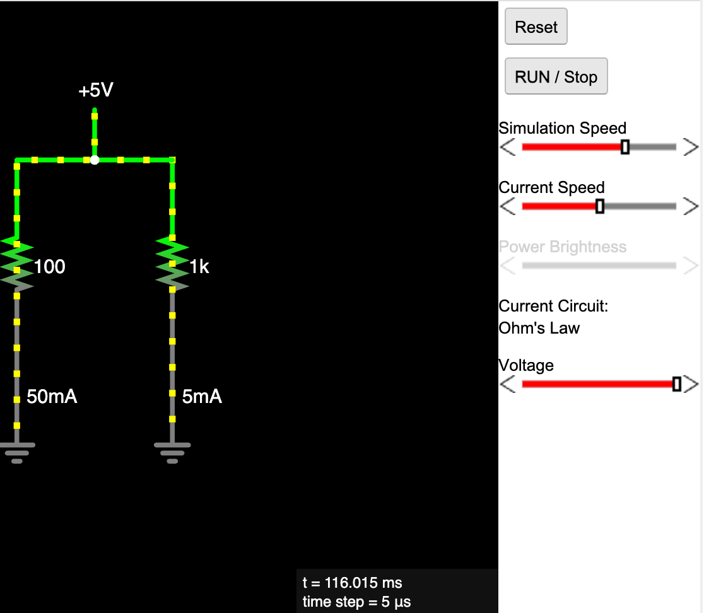

# Site References

1. [Univ. of MN Senior Seminar on EE MicroSims](https://kenn0727.github.io/ee-microsims/) - MicroSims created in winter term of 2024.
1. **mkdocs** - [https://www.mkdocs.org/](https://www.mkdocs.org/) - this is our tool for building the website.  It converts Markdown into HTML in the ```site``` directory.
2. **mkdocs material theme** - [https://squidfunk.github.io/mkdocs-material/](https://squidfunk.github.io/mkdocs-material/) - this is the theme for our site.  The theme adds the user interface elements that give our site the look and feel.  It also has the features such as social cards.
3. **GitHub Pages** - [https://pages.github.com/](https://pages.github.com/) - this is the free tool for hosting public websites created by mkdocs
4. **Markdown** - [https://www.mkdocs.org/user-guide/writing-your-docs/#writing-with-markdown](https://www.mkdocs.org/user-guide/writing-your-docs/#writing-with-markdown) - this is the format we use for text.  It allows us to have headers, lists, tables, links and images without learning HTML.
5. **Deploy Mkdocs GitHub Action** - [https://github.com/marketplace/actions/deploy-mkdocs](https://github.com/marketplace/actions/deploy-mkdocs) - this is the tool we use to automatically build our site after edits are checked in with Git.
6. **Git Book** - [https://git-scm.com/book/en/v2](https://git-scm.com/book/en/v2) - a useful book on Git.  Just read the first two chapters to learn how to check in new code.
7. **Conda** - [https://conda.io/](https://conda.io/) - this is a command line tool that keeps our Python libraries organized for each project.
8. **VS Code** - [https://code.visualstudio.com/](https://code.visualstudio.com/) - this is the integrated development environment we use to mange the files on our website.
9. **Markdown Paste** - [https://marketplace.visualstudio.com/items?itemName=telesoho.vscode-markdown-paste-image](https://marketplace.visualstudio.com/items?itemName=telesoho.vscode-markdown-paste-image) - this is the VS code extension we use to make sure we keep the markdown format generated by ChatGPT.

## Falstad

1. **Falstad Java Applet Index** - [Falstad Circuit Simulator](https://www.falstad.com/circuit/)
[List of Circuits](https://www.falstad.com/circuit/e-index.html)
1. **Falstad Source Code (Java) maintained by Rodrigo Hausen** - [Java Source Code](https://github.com/hausen/circuit-simulator/tree/master)
1. **Falstad Circuits** - many of the circuits are define by simple text 
files that place components are specific coordinates [Ohms Law](https://github.com/hausen/circuit-simulator/blob/master/src/circuits/ohms.txt)




```
$ 1 5.0E-6 10.391409633455755 50 5.0 50
r 256 176 256 304 0 100.0
172 304 176 304 128 0 6 5.0 5.0 0.0 0.0 0.5 Voltage
g 256 336 256 352 0
w 256 304 256 336 1
r 352 176 352 304 0 1000.0
w 352 304 352 336 1
g 352 336 352 352 0
w 304 176 352 176 0
w 256 176 304 176 0
```

In this file we can gusess each line is a component with the first
letter being the component letter.  We can guess the following key:

1. r - resistor x1, y1, x2, y2, ?, resistance-in-ohms
2. w - wire
3. g - ground
