# List of MicroSims for Circuits 1

Interactive Micro Simulations to help students learn electronic circuits fundamentals.

-   **[Animated Switches](./animated-switches/index.md)**

    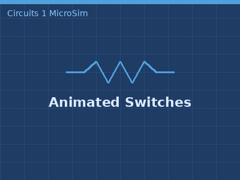

    Interactive circuit simulation with horizontal and vertical switches controlling animated current flow.

-   **[Animated Wire](./animated-wire/index.md)**

    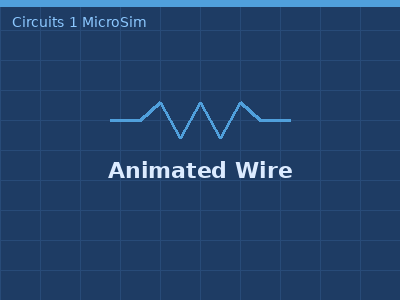

    Interactive simulation showing electron flow through a wire circuit with adjustable speed and spacing.

-   **[Audio Signal Chain](./audio-signal-chain/index.md)**

    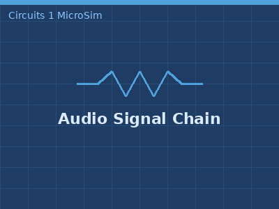

    Interactive audio signal chain from microphone to speaker with adjustable preamp gain, tone controls, and volume. Color-coded meters show bass, mid, and treble levels with clipping indicators.

-   **[Background Grid](./background-grid/index.md)**

    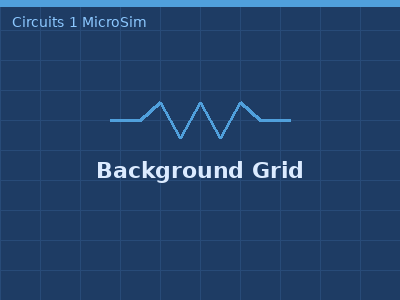

    Reference demonstration of the background grid layout used in MicroSims, showing the plot region and controls region.

-   **[Bandwidth and Selectivity](./bandwidth-selectivity/index.md)**

    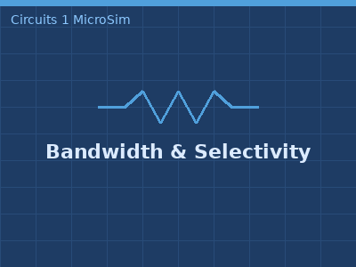

    Explore how the Q factor controls bandwidth and frequency selectivity by observing the bandpass frequency response curve, -3dB points, and passband shading.

-   **[Battery](./battery/index.md)**

    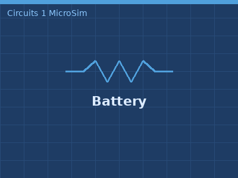

    Interactive simulation demonstrating battery symbols in horizontal and vertical orientations.

-   **[Battery Circuit](./dc-circuit/index.md)**

    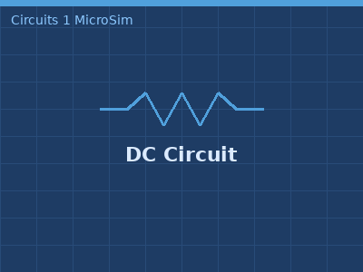

    Simple animated DC circuit showing current flow when a switch is closed.

-   **[Capacitor](./capacitor/index.md)**

    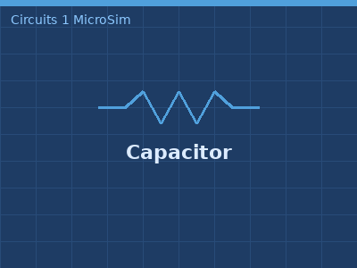

    Interactive simulation showing capacitor symbols with different values in horizontal and vertical orientations.

-   **[Capacitor Charging](./capacitor-charging/index.md)**

    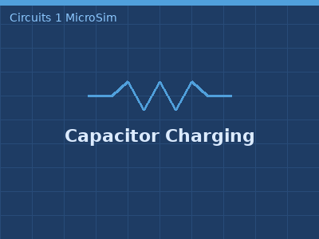

    Animate charge flow and observe voltage, current, and energy graphs during RC circuit charging and discharging.

-   **[Capacitor Combinations](./capacitor-combinations/index.md)**

    

    Compare series and parallel capacitor combinations side-by-side with real-time equivalent capacitance calculation.

-   **[Circuit Component Library](./circuit-lib/index.md)**

    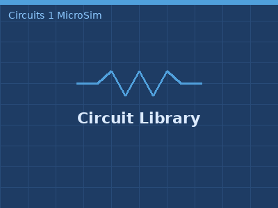

    Interactive test demonstration of the p5.js circuit component drawing library, showing all available symbols.

-   **[Circuit Similarity Map](./circuit-similarity/index.md)**

    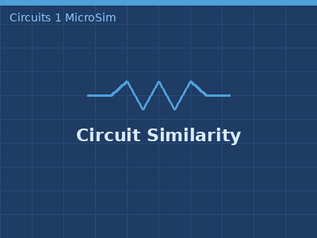

    Interactive 2D visualization of electrical circuits based on content similarity using D3.js force-directed layout.

-   **[Circuit Symbol Flashcards](./circuit-symbol-flashcards/index.md)**

    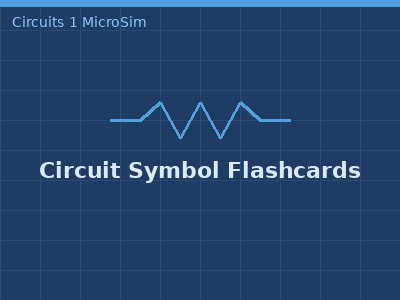

    Interactive flashcard trainer for learning circuit schematic symbols with flip animation and quiz mode.

-   **[Current Meter](./current-meter/index.md)**

    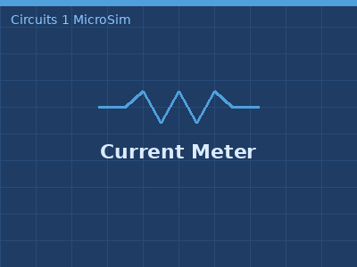

    Animated current meter showing how current is measured in a simple circuit.

-   **[Decibel Scale](./decibel-scale/index.md)**

    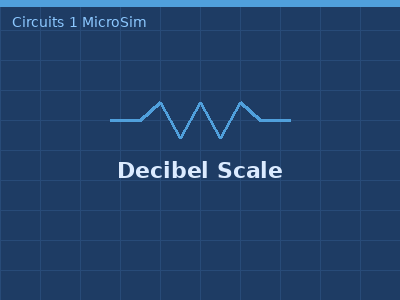

    Interactive dB calculator converting between linear ratios and decibels, with a vertical audio SPL reference scale.

-   **[Diode](./diode/index.md)**

    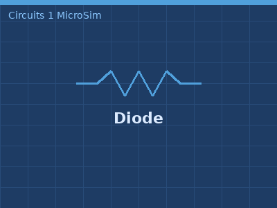

    Demonstration of diode schematic symbol drawing in a circuit context.

-   **[Exponential Properties](./exponential-properties/index.md)**

    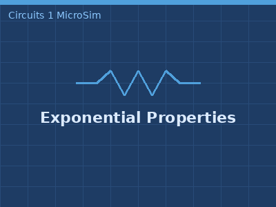

    Interactive MicroSim examining the tangent-line property, constant-ratio property, and derivative relationship of the exponential response.

-   **[Filter Frequency Response](./filter-frequency-response/index.md)**

    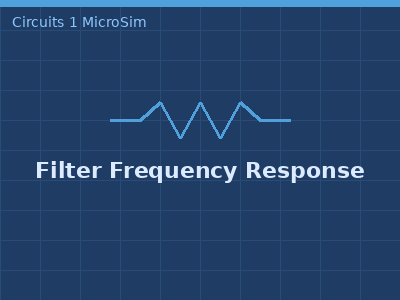

    Interactive Bode plot for RC low-pass and high-pass filters. Adjust R and C with sliders to see the cutoff frequency and magnitude response update in real time.

-   **[First-Order Filters](./first-order-filters/index.md)**

    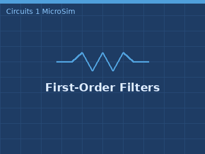

    Compare RC and RL implementations of low-pass and high-pass first-order filters with adjustable cutoff frequency and resistance.

-   **[Ground Symbols](./ground-symbols/index.md)**

    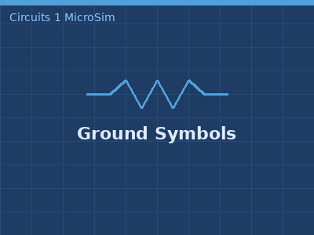

    Interactive reference guide for identifying and distinguishing between different ground symbols used in circuit schematics.

-   **[I-V Characteristics](./iv-characteristics/index.md)**

    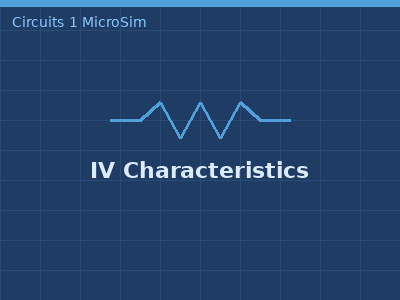

    Interactive chart comparing the linear I-V characteristic of a resistor with the nonlinear exponential characteristic of a diode.

-   **[Impedance Triangle](./impedance-triangle/index.md)**

    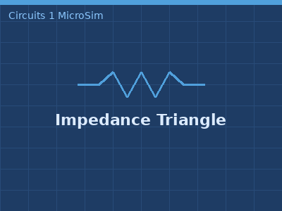

    Visualize the relationship between resistance, reactance, and impedance magnitude using an interactive right-triangle diagram with real-time calculations.

-   **[Inductor](./inductor/index.md)**

    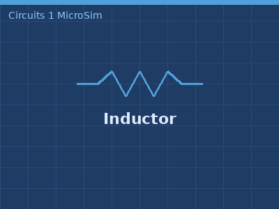

    Interactive simulation showing inductor symbols with different values in horizontal and vertical orientations.

-   **[Initial and Final Conditions](./initial-final-conditions/index.md)**

    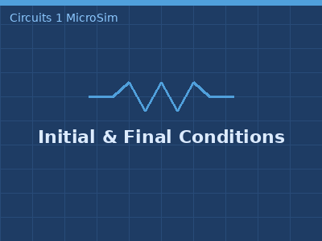

    Step-through MicroSim for finding V(0-), V(0+), V(∞), and τ in RC and RL switching circuits.

-   **[Kirchhoff's Laws](./kirchhoffs-law/index.md)**

    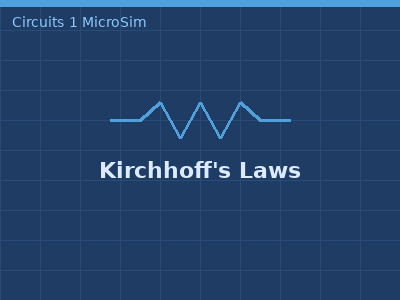

    Interactive MicroSim teaching KVL, KCL, mesh current method, and node voltage method using a live two-mesh circuit with adjustable components.

-   **[Learning Graph](./learning-graph/index.md)**

    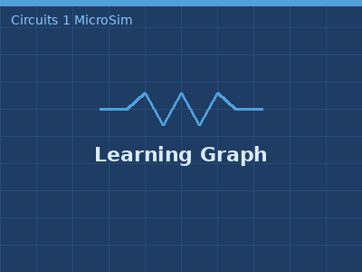

    Interactive visualization of the Circuits 1 course learning graph showing concept dependencies.

-   **[Learning Graph Viewer](./graph-viewer/index.md)**

    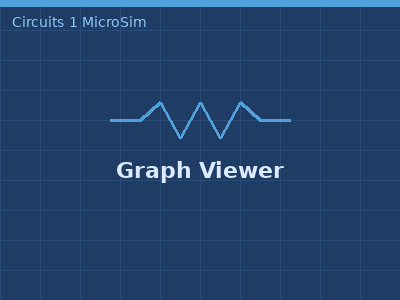

    Open learning graph viewer for exploring concept relationships and dependencies across the course.

-   **[Light Bulb](./light-bulb/index.md)**

    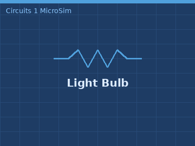

    Interactive circuit simulation with a switch-controlled light bulb showing animated current flow.

-   **[Mutual Inductance](./mutual-inductance/index.md)**

    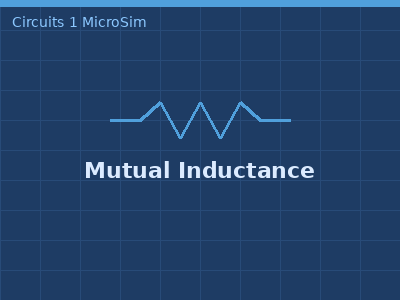

    Visualize magnetic field coupling between two inductors with animated field lines, coupling coefficient, and induced voltage.

-   **[Natural Frequency Calculator](./natural-frequency-calculator/index.md)**

    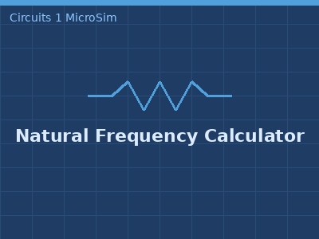

    Interactive calculator for the natural frequency of an LC circuit, showing the inverse square root relationship on a log-log plot.

-   **[Ohm's Law Triangle](./ohms-triangle/index.md)**

    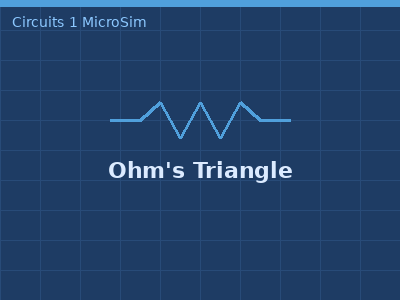

    Interactive Ohm's Law triangle — click any section to solve for voltage, current, or resistance, with instant power calculation.

-   **[Op-Amp Configurations](./opamp-configurations/index.md)**

    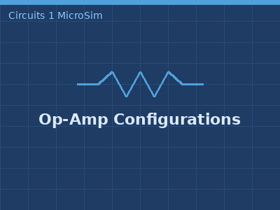

    Interactive comparison of inverting amplifier, non-inverting amplifier, and voltage follower with real-time gain and waveform display.

-   **[Op-Amp Golden Rules](./opamp-golden-rules/index.md)**

    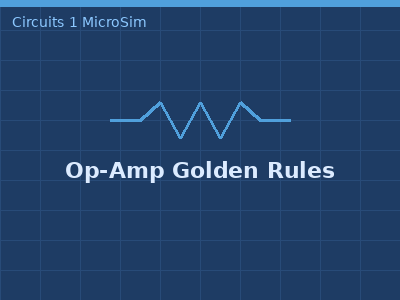

    Step through how negative feedback creates the two golden rules — virtual short and zero input current — in an inverting amplifier.

-   **[Oscilloscope Guide](./oscilloscope/index.md)**

    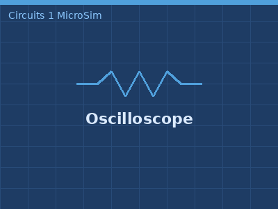

    Interactive oscilloscope simulator with graticule, triggered waveform display, V/div, T/div, trigger controls, and automatic measurements.

-   **[Parallel Plate Capacitor](./parallel-plate-capacitor/index.md)**

    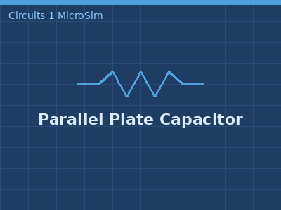

    Interactive visualization of how plate area, separation, and dielectric material affect capacitance.

-   **[Phasor Addition](./phasor-addition/index.md)**

    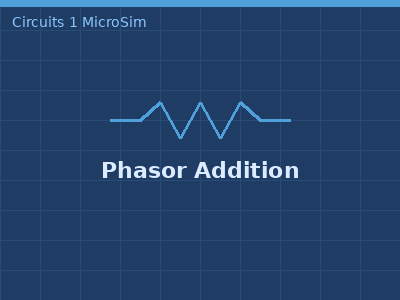

    Add two sinusoidal signals graphically using phasor head-to-tail construction and verify the result against time-domain waveforms.

-   **[Phasor Circuit Solver](./phasor-circuit-solver/index.md)**

    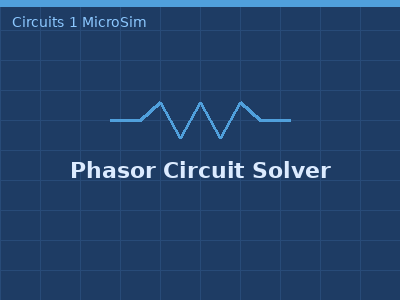

    Solve a series RLC circuit step-by-step in the phasor domain, computing impedances, current, and component voltages with a live phasor diagram.

-   **[Phasor Transformation](./phasor-transform/index.md)**

    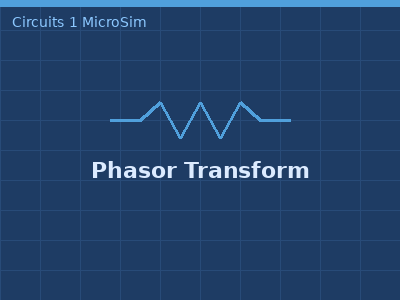

    Animate a rotating phasor on the complex plane and observe how its real-axis projection generates a time-domain sinusoid.

-   **[Power Triangle](./power-triangle/index.md)**

    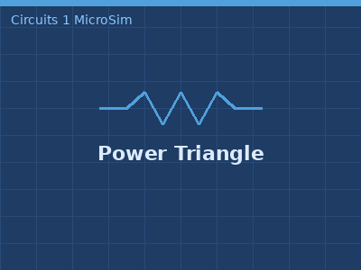

    Interactive power triangle for learning power, voltage, current, and resistance relationships using P=VI and Ohm's Law.

-   **[RC Charging](./rc-charging/index.md)**

    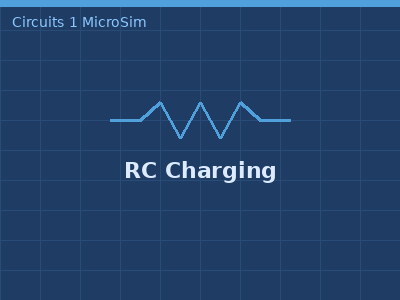

    Interactive simulation of an RC charging circuit with animated electron flow and real-time voltage and current graphs.

-   **[RC/RL Applications](./rc-rl-applications/index.md)**

    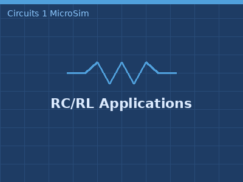

    Interactive MicroSim exploring four practical RC/RL timing circuits — camera flash, 555 timer, relay protection, and audio coupling.

-   **[Reactance vs Frequency](./reactance-frequency/index.md)**

    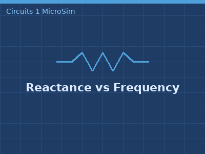

    Explore how inductive and capacitive reactance vary with frequency on a log-log plot, and identify the resonant crossover point where XL equals XC.

-   **[Real Capacitor Model](./real-capacitor-model/index.md)**

    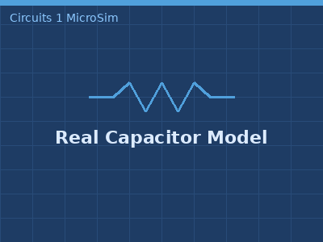

    Compare ideal vs real capacitor impedance across frequency, with ESR and ESL parasitics and self-resonant frequency marker.

-   **[Resistor](./resistor/index.md)**

    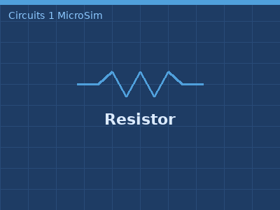

    Interactive simulation showing resistor symbols with different values in horizontal and vertical orientations.

-   **[Resonance Comparison](./resonance-comparison/index.md)**

    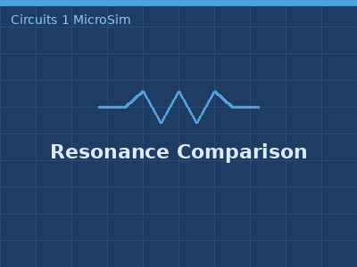

    Compare impedance and current behavior of series and parallel RLC circuits as frequency sweeps through resonance, highlighting their opposite responses.

-   **[RL Energizing](./rl-charging/index.md)**

    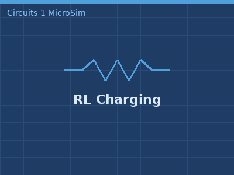

    Interactive simulation of an RL circuit showing inductor energizing and de-energizing with animated current flow and real-time graphs.

-   **[RLC Transient Response](./rlc-circuit/index.md)**

    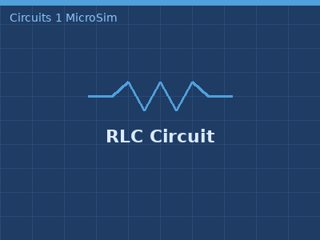

    Interactive simulation of a series RLC circuit showing overdamped, critically damped, and underdamped step responses with real-time Vc and IL graphs.

-   **[RMS Calculation](./rms-calculation/index.md)**

    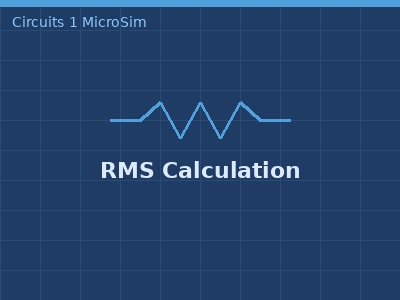

    Side-by-side AC and DC circuits demonstrating that Vrms delivers the same average power as an equivalent DC voltage.

-   **[Second-Order Filter Designer](./second-order-filter/index.md)**

    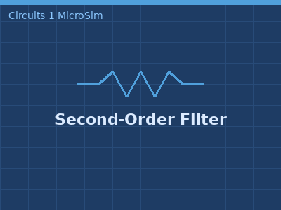

    Design second-order RLC filters by adjusting center frequency and Q factor across Low-Pass, High-Pass, and Band-Pass configurations.

-   **[Signal Parameters](./signal-parameters/index.md)**

    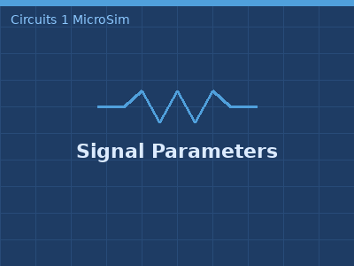

    Interactive sinusoidal waveform with labeled amplitude, period, frequency, phase, and optional reference signal overlay.

-   **[Switch](./switch/index.md)**

    

    Interactive simulation demonstrating on/off switch symbols in horizontal and vertical orientations.

-   **[Thévenin Equivalent Circuit](./thevenin-concept/index.md)**

    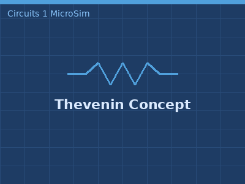

    A 5-stage interactive MicroSim demonstrating how any linear circuit can be replaced by a Thévenin equivalent voltage source in series with resistance.

-   **[Voltage Divider Calculator](./voltage-divider/index.md)**

    

    Interactive dual-mode calculator for designing voltage divider circuits to produce specific output voltages.

-   **[Water Flow Analogy](./water-flow-analogy/index.md)**

    

    Interactive simulation comparing water flow in pipes to electric current in wires, demonstrating voltage-pressure and current-flow rate analogies.

-   **[Wire](./wire/index.md)**

    

    Basic wire visualization demonstration for circuit simulations.

